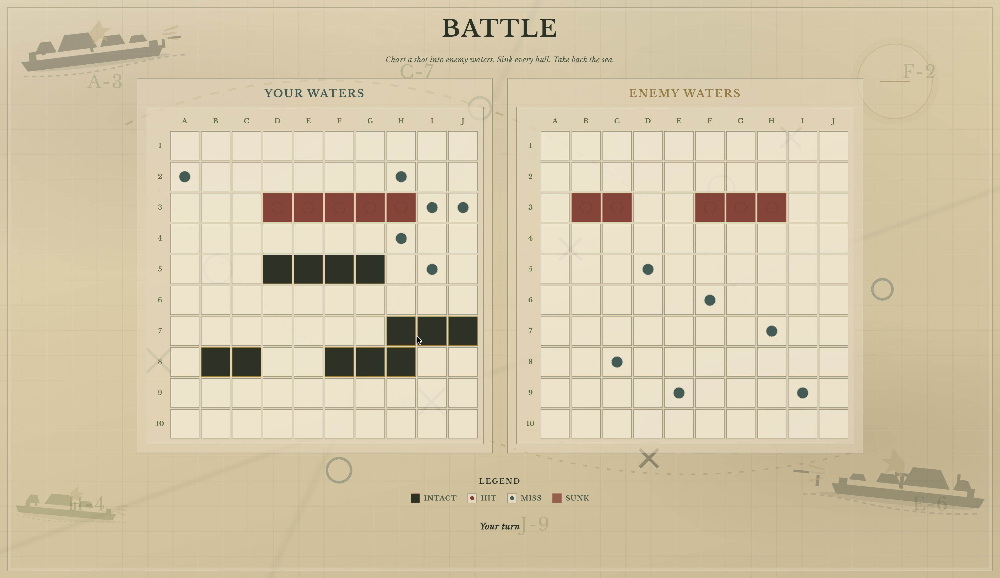

# Battle<span style="color: #9a7b3c;">ship</span>

A browser Battleship game: engrave your captain name, drag your fleet onto the chart, then trade shots with a computer opponent across **friendly** and **enemy** waters. Place five ships (carrier through destroyer) with horizontal or vertical orientation, then hunt the fogged enemy grid while the AI returns fire on yours – hits, misses, sunk hulls, and a native end-game dialog when one fleet is gone.

There is no backend. Everything runs in the browser: **Webpack** bundles vanilla JavaScript modules, and game state lives in memory for the session. The UI is plain **HTML** and **CSS** (parchment chart, olive and brass accents, **Libre Baskerville**) with three screens — **name-page**, **ship-page**, and **battle-page** — toggled with `hidden`. Battle uses dual boards, a legend, a turn label, and a `<dialog>` for victory or loss; fire, music, and end stings ride along as bundled audio.

This web version of the popular Battle<span style="color: #9a7b3c;">ship</span> game was built, inspired by The Odin Project (thanks to **The Odin Project** community), with my own nautical chart styling. If you are reading the repo, you will see how **Ship / Player / Gameboard**, **app turns**, and **DOM updates** are kept in separate modules, how HTML5 drag-and-drop feeds `placeShip`, and how the computer’s hunt-and-target logic works: after a hit it locks onto that open cell and builds predictive rays along each direction so the next shots chase the ship instead of guessing at random.

### What’s on `main` (current code)

The **default branch** conatains modules, implementing **ES6 classes** and a **factory**, plus **IIFE-style** orchestration:

- **`Ship`** — represents one vessel in the fleet and whether it is still afloat
- **`Player`** — represents one player(human/computer) in the match and holds that side’s board.
- **`Gameboard`** — manages a single chart: laying out the fleet and resolving attacks on that side
- **`AppController`** — coordinates the match itself — players, turns, and the flow of play between human and computer
- **`UIController`** — handles everything on screen, from page changes and placement to battle rendering and the end dialog

The UI is bundled with **Webpack 5** (dev server, production build, GitHub Pages deploy). Runtime code is still vanilla JavaScript — no React, Vue, or similar.

<p align="center">
  
  
</p>

#### Key engineering concepts used in this project

- **`Ship` and `Player` as ES6 classes; `Gameboard` as a factory** — board owns grid, placement rules, attack maps, and AI bookkeeping without leaking ship positions to the enemy UI
- **IIFE `AppController`** — small public API for setup, attacks, computer moves, and game-over checks without polluting the global scope
- **Separation of concerns** — models + turn logic vs DOM + events; the UI calls `AppController` instead of rewriting attack rules in click handlers
- **HTML5 drag and drop** — fleet items carry `ship-index` in `dataTransfer`; drop on a start cell runs `placeShip` with current H/V orientation
- **Fog of war** — enemy board never paints intact ships; only hit / miss / sunk markers show through
- **Hunt and target AI** — after a hit, rays out from `openHitCell`; miss drops a wrong direction; sink clears targeting state
- **Turn lock** — enemy grid gets `is-locked` (`pointer-events: none`) while the computer shoots; unlocked when it’s your turn again or on New Battle
- **Native `<dialog>`** — victory / loss modal with New Battle reset back to the name page
- **Webpack asset modules** — in-game music, fire, victory, and loss sounds imported into the UI layer
- **Jest** — unit tests for ship behavior and gameboard placement edge cases

## Getting Started

### **Try it online**

**Live game:** [https://soikat27.github.io/battleship/](https://soikat27.github.io/battleship/) — opens in the browser; no account or backend required.

### **Run it locally** (if you are cloning or tweaking the code)

You need **Node.js** and **npm** for the Webpack dev server and production build.

#### **Prerequisites**

- **Node.js** (LTS recommended) and **npm**
- **Git** (only if you use `git clone` below; otherwise use GitHub **Code → Download ZIP**)

#### Check that Git is installed (only if you clone)

```bash
git --version
```

#### **Installing**

##### 1. Clone this repository and open the project directory

```bash
git clone https://github.com/soikat27/battleship.git
```

```bash
cd battleship
```

##### 2. Install dependencies

```bash
npm install
```

#### **Running locally**

Start the development server (opens in the browser with hot reload):

```bash
npm run dev
```

#### **Production build**

```bash
npm run build
```

Built files are written to `dist/`. You can serve that folder with any static host or use `npm run deploy` for GitHub Pages.

## Using the app

The same behavior applies on the [live demo](https://soikat27.github.io/battleship/) and when you run the dev server locally.

### Features

- **Captain name** — enter combat from the name page (validation for empty / too-long names)
- **Fleet placement** — drag ships onto your chart; toggle **Horizontal** / **Vertical**; reset to clear the board
- **Start Battle** — stays disabled until every ship is placed; then the computer’s fleet is placed randomly
- **Dual boards** — your waters (ships visible) and enemy waters (fogged until you shoot)
- **Combat with Computer-Intelligent-Move** — click enemy cells for hit/miss; the computer answers with hunt-and-target shots (after a hit it builds predictive rays to chase the ship)
- **Legend** — intact, hit, miss, and sunk markers
- **Sunk ships** — both boards highlight sunk hulls
- **Sounds** — looping chart music, fire on shots, victory or loss sting at the end
- **New Battle** — reset and return to the name page for another match

### Usage

- Open the app → enter your name → **Enter Combat**
- Pick **Horizontal** or **Vertical**, drag each fleet item onto a start cell
- Use **Reset** if you want a clean chart; **Start Battle** when the fleet is ready
- Click cells in **Enemy Waters** on your turn; wait through the computer’s turn when the grid locks
- When the gameover dialog opens, hit **New Battle** to sail again from the name page

## Available Scripts

- `npm run dev` — Webpack Dev Server with hot reload
- `npm run build` — production build into `dist/`
- `npm run deploy` — `npm run build` then publish `dist/` to the `gh-pages` branch via `gh-pages`
- `npm test` — Jest unit tests
- `npm run lint` / `npm run lint:fix` — ESLint
- `npm run format` / `npm run format:check` — Prettier

## Deployment

The deploy script runs:

```bash
npm run build && gh-pages -d dist
```

That builds the project, then publishes the generated `dist/` folder to GitHub Pages. This repo is set up for **https://soikat27.github.io/battleship/** — make sure `homepage` in `package.json` matches your repository name if you fork or rename.

You could also host the same `dist/` output on Netlify, Cloudflare Pages, or any static file host.

## Built with

- Plain **HTML**, **CSS**, and **JavaScript** (no UI framework)
- **Webpack 5** — `webpack.common.js`, `webpack.dev.js`, `webpack.prod.js`
- **HtmlWebpackPlugin** + **html-loader** — builds from `src/template.html`
- **Jest** — `Ship` and `Gameboard` tests
- **ES6 classes** — `Ship`, `Player`
- **Factory module** — `Gameboard`
- **IIFE / factory modules** — `AppController`, `UIController`
- **HTML5 Drag and Drop** — fleet placement
- **`<dialog>`** — end-game modal
- **Libre Baskerville** — display and body type (bundled)

## Contributing

Contributions are welcome and appreciated. Open an issue or send a PR if you want to tighten AI edge cases, grow the test suite, improve accessibility, or teach me something I missed.

## Author

- **Soikat Saha** — design and implementation

## License

This project is licensed under the MIT License — see the [LICENSE](LICENSE) file for details.

## Acknowledgments

- Shoutout to the **Odin Project** community and curriculum for the Battleship assignment and the push toward modular JS and testing.
- Thanks to everyone who maintains solid **MDN** docs — Drag and Drop, `<dialog>`, and the Audio API got plenty of use.
- Built on my own **Webpack starter template**; kept the runtime vanilla on purpose so the module boundaries stay easy to follow in a portfolio read-through.
